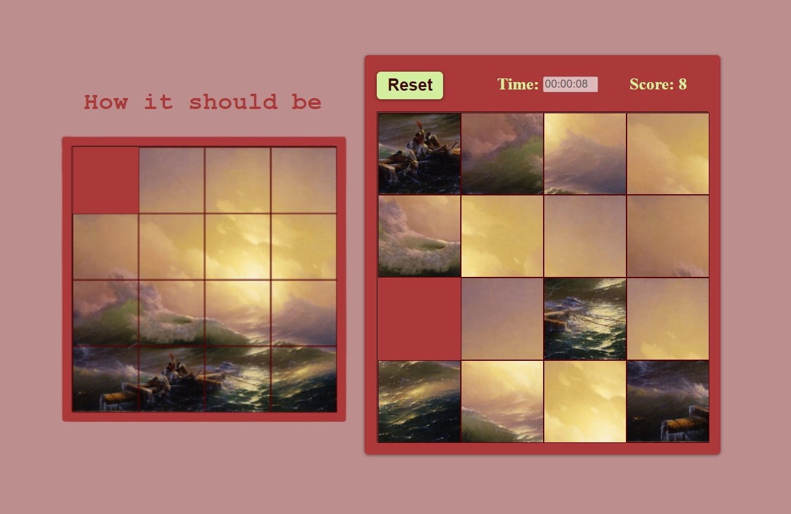

# gem-puzzle

Here is the well-known game Gem-puzzle. There are 15 tiles on the field, moving which the player should get the picture shown in the sample on the left. When the page is loaded and the Reset button is pressed, the state of the playing field is generated randomly. After the start of the game, a counting of moves and a timer are started. The movement of the knuckles and the end of the game are accompanied by sounds. 

The index.html file is empty, all elements are generated via JavaScript. The application is displayed correctly both on the desktop and on the mobile device. 

<strong>Tools: pure HTML and CSS, Vanilla JS, CSS-Flexbox, CSS-Variables, DocumentFragment</strong> 

You can find the code <a href="https://github.com/confesssa/gem-puzzle">here</a>. Deploy is <a href="https://confesssa.github.io/gem-puzzle/">here</a> or you can click on the image below.

